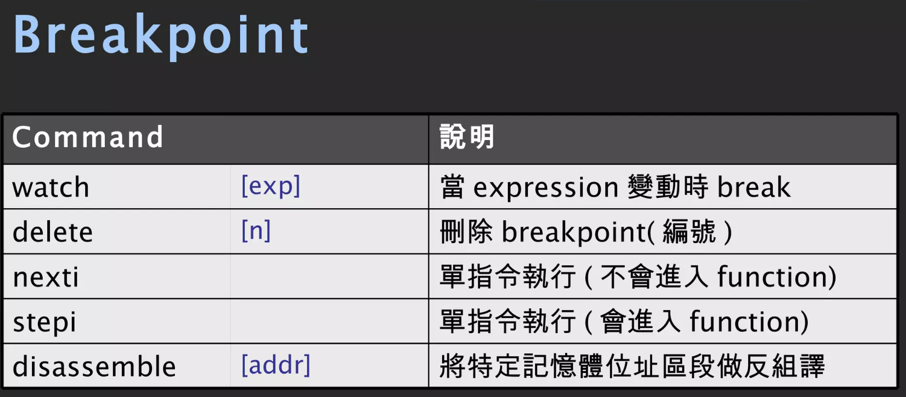

# GDB Learning Record

## GDB的妙用
Ref: [GDB的妙用](https://blog.vgod.tw/2006/06/21/gdb%E7%9A%84%E5%A6%99%E7%94%A8/)

GDB 可以幫助我們在程式 runtime 時變更程式的行為，以這篇文章為例，他希望程式在接收到 ```SIGHUP``` 前，把這個 signal 檔下來，

這裡的 ```SIGHUP``` 是什麼呢？在關閉 terminal 時，會送 ```SIGHUP``` 給執行程式，如果程式不處理該 signal，程式會被關閉，

利用 GDB，我們就能在程式執行到一半時，attach到它的process上，並在runtime改變程式的執行流程和行為，進而攔截```SIGHUP``` signal 了。

下面是具體作法：

1. 用ps和grep找出欲攔截程式的pid
2. 用gdb attach它: gdb [program] [pid]
3. 在gdb內輸入: ```handle SIGHUP nopass```

## Introduction to gdb
Ref: [Introduction to gdb](https://www.slideshare.net/owenhsu/introduction-to-gdb-3790833)

下圖為進到 gdb command line 後，常用的指令：


下面則是 info 指令可以搭配使用看到的資訊：


下面則是 breakpoint 相關的指令：



## GDB Documentation
Ref: [GDB Documentation](https://www.sourceware.org/gdb/documentation/)

## GDB Tutorial
Ref: [GDB Tutorial](https://www.youtube.com/watch?v=svG6OPyKsrw&t=41s)